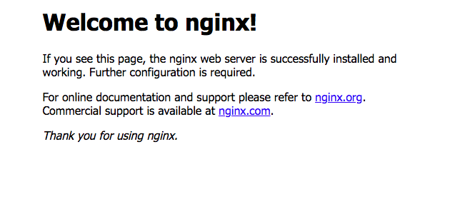

# Development environment lab

## installation

1. if you do not have virtualbox download it [here](https://www.virtualbox.org/wiki/Downloads)

2. if you do not have vagrant installed download it [here](https://www.vagrantup.com/downloads.html)

3. once both virtualbox and vagrant are installed, navigate to the directory you want to be the root of your project and enter in the terminal

  ```terminal
    vagrant init ubuntu/xenial64
  ```

4. when the process is complete, type ```ls``` in your terminal to ensure that the Vagrantfile is there

5. open the Vagrantfile in you text editor

6.  just underneath the ```config.vm.box = "ubuntu/xenial64"``` line enter the following command and save the file:

  ```terminal
    config.vm.network "private_network", ip:"192.168.10.247"
  ```
7. in the terminal enter the following command (this may take awhile):
  ```terminal
    vagrant up
  ```
8. When the process is complete enter this command into the terminal:
  ```terminal
    vagrant ssh
  ```
9. when in the virtual machine run these commands after each other

  ```terminal
    sudo apt-get update && sudo apt-get upgrade -y
  ```
10. install nginx using this command:
  ```terminal
    sudo apt-get install nginx -y
  ```
11. to check that it is working correctly enter in the terminal:
  ```terminal
    curl 192.168.10.247
  ```
  if the following appears you have installed correctly

  ```terminal
  <!DOCTYPE html>
  <html>
    <head>
      <title>Welcome to nginx!</title>
      <style>
        body {
          width: 35em;
          margin: 0 auto;
          font-family: Tahoma, Verdana, Arial, sans-serif;
        }
      </style>
    </head>
    <body>
      <h1>Welcome to nginx!</h1>
      <p>If you see this page, the nginx web server is successfully installed and
      working. Further configuration is required.</p>

      <p>For online documentation and support please refer to
      <a href="http://nginx.org/">nginx.org</a>.<br/>
      Commercial support is available at
      <a href="http://nginx.com/">nginx.com</a>.</p>

      <p><em>Thank you for using nginx.</em></p>
    </body>
  </html>
  ```
  12. if you enter ```192.168.10.247``` into your browser you should see the following page:


  
